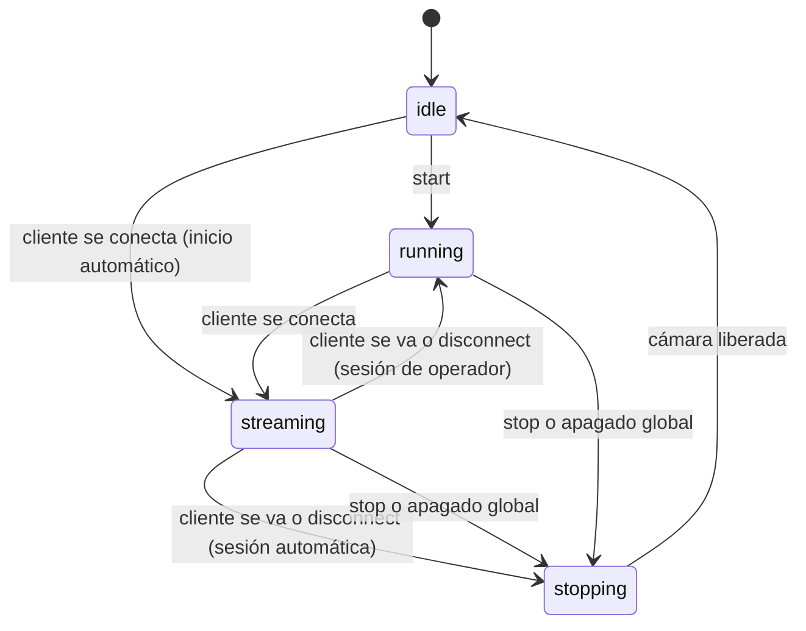

# M07 — Ciclo de vida de la sesión de cámara

**Ticket:** OMC-88 · **Secuencia:** M07 · **Depende de:** M02 y M05

## Alcance

Implementar el inicio, la detención, la consulta de estado, la conexión del único cliente, su desconexión y el apagado global, para una sola cámara.

## Resumen

Antes de M07, la cámara solo existía mientras un cliente estaba conectado al WebSocket: conectarse la abría y desconectarse la cerraba. Ahora la sesión tiene un ciclo de vida propio, con estados consultables, operaciones explícitas para administrarla y un historial de eventos que cuenta cómo transcurrió cada conexión.

El frontend no necesita cambiar nada. Conectarse al WebSocket sigue iniciando la sesión por sí solo; las operaciones nuevas son para administración, pruebas y diagnóstico.

## Estados

| Estado | Cámara | Cliente | Cuándo ocurre |
|---|---|---|---|
| `idle` | Cerrada | Ninguno | Al arrancar el servidor, o después de detener la sesión |
| `running` | Abierta | Ninguno | Un operador inició la sesión, o el cliente se fue de una sesión iniciada por operador |
| `streaming` | Abierta | Uno | Hay un cliente recibiendo frames |
| `stopping` | Cerrándose | Ninguno | Transitorio: el hardware se está liberando (en Windows tarda unos 300 ms) |



### Quién inicia la sesión

El campo `started_by` decide qué pasa cuando el cliente se va:

| `started_by` | Cómo se inició | Al irse el cliente |
|---|---|---|
| `client` | El cliente se conectó con la sesión en `idle` | La cámara se cierra sola (`auto_stop`), igual que antes de M07 |
| `operator` | Alguien llamó a `POST /cameras/session/start` | La cámara sigue abierta en `running`, lista para el siguiente cliente |

Así, la cámara nunca queda encendida sin que alguien lo haya pedido, y un operador puede mantenerla abierta para evitar el costo de reabrir el hardware entre clientes.

## Interfaz

### Operaciones REST

| Operación | Endpoint | Respuesta exitosa |
|---|---|---|
| Iniciar | `POST /cameras/session/start?camera_id=0` | `201`, sesión en `running` |
| Detener | `POST /cameras/session/stop` | `200`, sesión en `idle` |
| Desconectar al cliente | `POST /cameras/session/disconnect` | `200`, con el `client_id` expulsado |
| Consultar estado | `GET /cameras/session` | `200`, estado completo |

Las operaciones responden con una estructura uniforme. Cuando hay error, `data` incluye el estado actual de la sesión, para que quien recibe el error sepa en qué situación quedó todo sin tener que hacer otra consulta:

```json
{
  "data": { "state": "running", "started_by": "operator", "...": "..." },
  "error": "SESSION_ALREADY_ACTIVE",
  "meta": { "description": "Ya hay una sesión activa con la cámara '0'." }
}
```

### Consulta de estado

`GET /cameras/session` conserva los campos de M02 (`status`, `camera_id`, `active_client`, `metrics`, `errors`) y agrega:

| Campo | Significado |
|---|---|
| `state` | Estado del ciclo de vida: `idle`, `running`, `streaming` o `stopping` |
| `started_by` | `client` u `operator` (solo con sesión activa) |
| `accepting_clients` | `false` después del apagado global |
| `events` | Historial de los últimos 50 eventos del ciclo de vida |

`status` describe la salud de la sesión (puede ser `error` si la cámara falló), mientras que `state` describe en qué punto del ciclo está. Son preguntas distintas y por eso se reportan por separado.

### Historial de eventos

Cada evento tiene un número consecutivo `seq`, que ordena los eventos sin ambigüedad aunque dos tengan el mismo `timestamp` (en Windows, el reloj del sistema avanza cada ~15.6 ms).

| Evento | `reason` posibles |
|---|---|
| `started` | `client`, `operator` |
| `client_connected` | — |
| `client_disconnected` | `client_left` (el cliente se fue), `operator` (expulsión o detención), `shutdown` |
| `stopped` | `operator`, `auto_stop` (se fue el cliente que la inició), `abandoned` (el cliente se canceló mientras se abría la cámara), `shutdown` |
| `shutdown` | `released` (había sesión), `already_idle` (no había) |

### WebSocket

`/ws/stream` y `/ws/inference-stream` comparten la misma sesión y el mismo flujo de conexión (`app/api/ws_camera.py`). Entre los dos solo puede haber un cliente a la vez, y ambos responden con los mismos mensajes y códigos.

**Conexión aceptada** (primer mensaje):

```json
{
  "connected": true,
  "camera_id": "0",
  "client_id": "d8d47fe4-...",
  "state": "streaming",
  "started_by": "client",
  "error": null,
  "description": "Cámara detectada. Iniciando transmisión de video."
}
```

**Fin o rechazo** (siempre antes del cierre):

```json
{ "connected": false, "camera_id": "0", "error": "SESSION_STOPPED", "description": "La sesión de cámara fue detenida." }
```

## Errores controlados

| Código | REST | Cierre WS | Cuándo ocurre |
|---|---|---|---|
| `SESSION_ALREADY_ACTIVE` | 409 | — | `start` con una sesión ya iniciada |
| `SESSION_NOT_ACTIVE` | 409 | — | `stop` sin sesión |
| `NO_CLIENT_CONNECTED` | 409 | — | `disconnect` sin cliente |
| `CAMERA_BUSY` | — | 1008 | Un segundo cliente intenta conectarse |
| `CAMERA_MISMATCH` | — | 1008 | El cliente pide una cámara distinta a la de la sesión activa |
| `CAMERA_UNAVAILABLE` | 503 | 1000 | La fuente no pudo abrirse |
| `SERVICE_SHUTTING_DOWN` | 503 | 1001 | Se intenta iniciar o conectar después del apagado global |
| `SESSION_STOPPED` | — | 1000 | Un operador detuvo la sesión con el cliente conectado |
| `CLIENT_DISCONNECTED` | — | 1000 | Un operador expulsó al cliente |
| `SERVICE_SHUTDOWN` | — | 1001 | El servidor se apagó con el cliente conectado |
| `CAMERA_NO_FRAMES` | — | 1000 | La cámara dejó de entregar frames |
| `PROCESSING_ERROR` | — | 1011 | Falló el procesamiento del frame (por ejemplo, la inferencia) |

Una transición inválida nunca altera la sesión: el estado y el historial de eventos quedan exactamente como estaban.

## Apagado global

Cuando el servidor se detiene, el `lifespan` de FastAPI (`app/main.py`) ejecuta `camera_session_manager.shutdown()`. El apagado:

1. Deja de aceptar sesiones y clientes nuevos (`accepting_clients: false`).
2. Libera la cámara si había sesión. El cliente conectado, si lo hay, recibe `SERVICE_SHUTDOWN`.
3. Registra un evento `shutdown` con `released` o `already_idle`.
4. Anuncia el resultado en la consola del servidor.

Es idempotente: llamarlo varias veces no falla ni repite la liberación; cada llamada solo registra su evento. Se comprueba de tres formas: con las pruebas automatizadas, con el historial de eventos y con el mensaje en la consola al presionar Ctrl + C:

```
INFO:     Waiting for application shutdown.
INFO:     Apagado global de cámara: sesión liberada
INFO:     Application shutdown complete.
```

## Decisiones técnicas

**Modo compatible con el frontend.** El equipo pidió que el frontend siga conectándose directo al WebSocket, sin llamar a `start`. Por eso la conexión inicia la sesión cuando está en `idle`, y el campo `started_by` permite que esa sesión se cierre sola al irse el cliente.

**Un solo flujo para los dos WebSocket.** El código que atiende la conexión estaba duplicado entre `/ws/stream` y `/ws/inference-stream`, con mensajes y manejo de errores distintos. Ahora ambos usan `run_camera_stream`, y solo cambia lo que cada uno hace con el frame. Esto garantiza la interfaz coherente que pide el criterio 1.

**Detener espera la lectura en curso.** Cada sesión tiene un candado de lectura (`io_lock`). Si alguien detiene la sesión mientras se lee un frame, el gestor espera a que esa lectura termine antes de liberar la cámara, en lugar de cerrarla a mitad.

**Operaciones resistentes a la cancelación.** FastAPI y Starlette usan anyio, que cancela tareas repitiendo la cancelación en cada `await`. Eso anulaba la protección de M03, que esperaba a que el hilo de hardware terminara antes de soltar el candado: la espera misma se cancelaba. Ahora cada operación del gestor corre en una tarea propia (`_run_detached`). Si quien la pidió se cancela, la operación termina igual, y si el cliente se fue mientras se abría la cámara, la apertura se deshace dentro del mismo candado. Una prueba reproduce esa cancelación y falla con el diseño anterior.

**Estado transitorio `stopping`.** Liberar la cámara no es instantáneo. Sin este estado, la API reportaba `idle` mientras el hardware seguía cerrándose.

**Compatibilidad con M02 y M03.** `acquire` y `release` se conservan como alias de `connect_client` y `disconnect_client`, y los campos de estado de M02 no cambian. Las pruebas de M02 y M03 pasan sin modificaciones.

## Impacto en el frontend

Todos los cambios son aditivos. El frontend puede seguir funcionando sin modificaciones:

| Lo que ya usaba | ¿Cambió? |
|---|---|
| Conectarse al WebSocket sin llamar nada antes | No |
| Los campos `connected`, `camera_id` y `description` | No |
| El protocolo binario de frames (encabezado + JSON + JPEG) | No |
| Cierre 1008 con la cámara ocupada | No |

Lo nuevo, que puede aprovechar si lo necesita: los campos `client_id`, `state`, `started_by` y `error` en los mensajes JSON; el cierre 1001 cuando el servidor se apaga; y las causas `SESSION_STOPPED` y `CLIENT_DISCONNECTED`, que solo ocurren si un operador actúa. Se recomienda que el frontend decida qué mostrar según `error`, en lugar de interpretar el texto de `description`.

## Pruebas

Todas corren sin cámara física: `open_camera` se reemplaza por una cámara simulada que cuenta aperturas, cierres e instancias abiertas a la vez.

```powershell
cd backend
python -m pytest -v
```

| Archivo | Qué cubre |
|---|---|
| `tests/test_session_lifecycle.py` | Estados, transiciones válidas e inválidas, concurrencia, cancelación repetida y apagado global, a nivel gestor |
| `tests/test_ws_lifecycle.py` | Ciclo de vida a través de los dos WebSocket, mensajes de fin y códigos de cierre |
| `tests/test_lifecycle_api.py` | Endpoints REST, respuestas de error y apagado global conectado al cierre de FastAPI |

| Criterio | Evidencia |
|---|---|
| Todas las operaciones disponibles mediante una interfaz coherente | `test_c1_*`, `test_ciclo_completo_por_rest_y_websocket`, `test_ambos_websocket_comparten_un_solo_cliente`, `test_inference_stream_responde_igual_ante_stop` |
| Las transiciones inválidas generan errores controlados | `test_c2_*`, `test_transiciones_invalidas`, `test_error_no_altera_la_sesion_activa`, `test_camara_distinta_a_la_de_la_sesion_se_rechaza` |
| Solo una sesión y un cliente activo | `test_c3_*` (inicios, detenciones y operaciones mezcladas en concurrencia; cancelación repetida), `test_segundo_cliente_rechazado_con_sesion_de_operador` |
| Apagado global idempotente y comprobable | `test_c4_*`, `test_apagado_global_al_cerrar_la_aplicacion`, `test_apagado_global_sin_sesion_y_repetido`, `test_shutdown_avisa_al_cliente_y_rechaza_nuevas_conexiones` |

## Demostración funcional

Con el servidor en marcha (`uvicorn app.main:app --port 8000 --workers 1`), en Postman:

1. `POST /cameras/session/start?camera_id=0` → `201`, `running`, `started_by: operator`.
2. Repetir el `start` → `409 SESSION_ALREADY_ACTIVE`.
3. Conectar `ws://localhost:8000/ws/stream?camera_id=0` → bienvenida con `started_by: operator`. Desconectar y consultar `GET /cameras/session` → sigue en `running`.
4. Conectar de nuevo y llamar a `POST /cameras/session/disconnect` → el WebSocket recibe `CLIENT_DISCONNECTED`.
5. Conectar de nuevo y llamar a `POST /cameras/session/stop` → el WebSocket recibe `SESSION_STOPPED`; el estado pasa a `idle`.
6. Repetir el `stop` → `409 SESSION_NOT_ACTIVE`.
7. Con un WebSocket en `/ws/stream`, conectar otro en `/ws/inference-stream` → `CAMERA_BUSY`, cierre 1008.
8. Hacer `start` y presionar Ctrl + C **una sola vez** en la consola del servidor → aparece `Apagado global de cámara: sesión liberada`. Presionarlo dos veces fuerza el cierre y se salta el apagado ordenado.

## Limitaciones y pendientes

- **Un solo worker.** Los candados viven en la memoria del proceso; con varios workers de uvicorn, cada uno tendría su propio gestor.
- **El apagado global es definitivo.** Después de `shutdown`, el gestor rechaza sesiones nuevas hasta reiniciar el servidor. No se expone como endpoint para evitar dejar el servicio inutilizable por error.
- **Abrir la cámara tarda.** En Windows, `start` puede tardar entre 1 y 2 segundos por la inicialización del driver. Durante ese tiempo, otras operaciones esperan su turno.
- **Inferencia sin modelos.** Si `ultralytics` no está instalado (`requirements-models.txt`), `/ws/inference-stream` responde `PROCESSING_ERROR`. Es el comportamiento esperado, no un defecto del ciclo de vida.
- **Configuración inconsistente, fuera del alcance.** `max_cameras` vale 4 en `config.py` mientras `MAX_CONCURRENT_CAMERAS` vale 1 en `limits.py`, y `ws_max_queue_size` no se usa.

## Archivos

| Archivo | Cambio |
|---|---|
| `app/services/camera_session_manager.py` | Estados, operaciones, eventos, tareas desacopladas y estado `stopping` |
| `app/core/limits.py` | Nueva constante `LIFECYCLE_EVENT_HISTORY` |
| `app/api/ws_camera.py` | Nuevo: flujo compartido de los WebSocket |
| `app/api/routers/stream.py` | Usa el flujo compartido |
| `app/api/routers/inference.py` | `/ws/inference-stream` usa el flujo compartido; los endpoints REST de inferencia no cambian |
| `app/api/routers/cameras.py` | Endpoints `start`, `stop` y `disconnect` |
| `app/main.py` | Apagado global en el `lifespan` |
| `tests/test_session_lifecycle.py`, `tests/test_ws_lifecycle.py`, `tests/test_lifecycle_api.py` | Nuevas pruebas |
